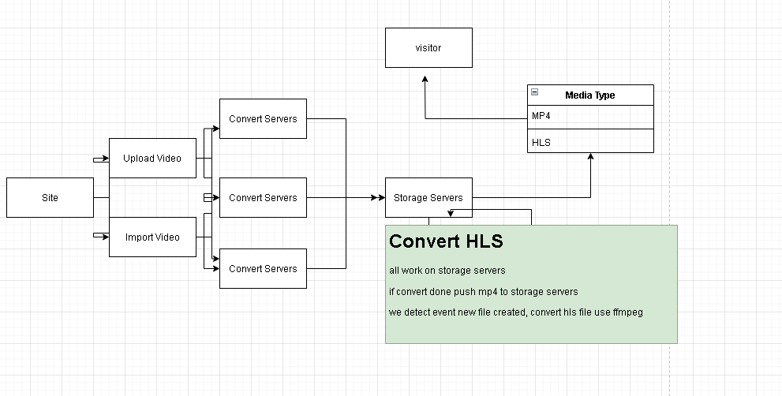
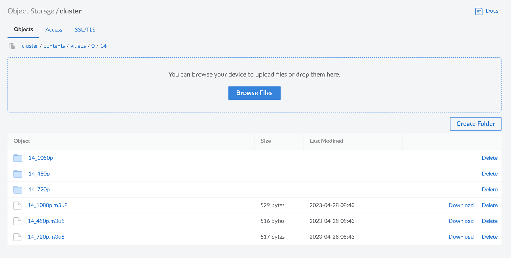

[TOC]
# KVS Automatic Tanscoding (MP4 To HLS)

主要功能将MP4文件转换为HLS格式  
这是一个简单的解决方案,基于文件上传至存储服务器的时候触发转码行为  
支持处理已有文件  
也支持利用三方软件(rclone)同步至远程,例如S3对象存储  

#### 优点
1. 生成标准HLS文件 (包括m3u8/ts切片)
2. 支持工作流,例如各种同步,缓存等

#### 缺点
1. 实时处理, 采用监控文件变更的方式,如果文件数量巨大,处理起来可能有性能问题
2. 存储空间, 硬盘占用加倍, 例如 1GB大小 的 1_1080P.mp4 生成HLS以后会占用2GB
3. 播放器更新, 因为KVS默认播放器不支持HLS,需要更换为其它 例如 plyr,videojs,more....

## 工作流



## 准备工作
1. 确认硬盘容量足够
   2. 	例如: 已有MP4文件占用1T,那么如果需要转换为HLS格式,就需要有1T硬盘空闲
2. 确认各项参数是否一致


## 部署方式

### 软件需求
> 如果已安装直接跳过,该软件安装即可

```shell
#### ffmpeg 
cd /opt
wget https://johnvansickle.com/ffmpeg/releases/ffmpeg-release-amd64-static.tar.xz
tar xvf ffmpeg-release-amd64-static.tar.xz
mv ffmpeg-6.0-amd64-static /usr/local/ffmpeg
ln -s /usr/local/ffmpeg/ffprobe  /usr/bin/ffprobe
ln -s /usr/local/ffmpeg/ffmpeg /usr/bin/ffmpeg
ln -s /usr/local/ffmpeg/qt-faststart /usr/bin/qt-faststart

#### inotify
cd /opt
wget https://github.com/inotify-tools/inotify-tools/archive/refs/tags/3.22.6.0.tar.gz
tar xfz 3.22.6.0.tar.gz
cd inotify-tools-3.22.6.0
./autogen.sh
./configure --prefix=/usr/local
make
su -c 'make install'

#### rclone
cd /opt
wget https://downloads.rclone.org/v1.62.2/rclone-v1.62.2-linux-amd64.zip
unzip rclone-v1.62.2-linux-amd64.zip
mv rclone-v1.62.2-linux-amd64 /usr/local/rclone
ln -sf /usr/local/rclone/rclone /usr/local/bin/rclone

# /usr/bin/ffmpeg
# /usr/bin/ffprobe
# /usr/bin/qt-faststart
# /usr/local/bin/inotifywait
# /usr/local/bin/inotifywatch
# /usr/local/bin/rclone

#### 脚本安装
* 放你视频文件存储的服务器上
cd /home/storage
wget -c https://raw.githubusercontent.com/kernel-video-sharing/kvs-automatic-hls/main/transcode.sh
chmod +x transcode.sh
./transcode.sh -h

```


### 使用工具

### Step 1: 配置

首先配置 `transcode.sh` 中的
```shell

HLS_TIME=10;                   # TS切片时长,可以根据需要定制,TS文件不要超5M为最佳,因为会发起大量请求TS文件,越大越容易断流

SYNC_ENABLE=1;                 # 如果需要把切片好的M3U8/TS文件同步至远程的分发服务器,设置为1且设置下面的AWS变量
SYNC_DELETE=0;                 # 如果需要存储服务器已满需要处理切片,设置为1,这样会生成HLS,然后上传至远程服务器在删除本地HLS文件节省空间
SYNC_REMOTE="S3:cluster";      # Rclone的NAME,定义
```

### Step 2: 处理

先测试下	
直接存储MP4文件的服务器运行	
	`bash transcode.sh -f MP4文件路径`	
例如		
	`bash transcode.sh -f /home/storage/contents/videos/0/14/14_720p.mp4`	
如果生成OK , 应该可以看到下列列表	
```shell
root@localhost:/test# tree /home/storage/contents/videos/0/14
/home/storage/contents/videos/0/14
├── 14_1080p.mp4
├── 14_480p.mp4
├── 14_720p
│   ├── 000.ts
│   ├── 001.ts
│   ├── 002.ts
│   ├── 003.ts
│   ├── 004.ts
│   ├── 005.ts
│   ├── 006.ts
│   ├── 007.ts
│   ├── 008.ts
│   ├── 009.ts
│   ├── 010.ts
│   └── 011.ts
├── 14_720p.m3u8
├── 14_720p.mp4
└── 14_preview.mp4

1 directory, 17 files
```

如果开启了同步,在对象存储或者目标存储服务器也可以看到



#### 第一种情况
	网站已经上线,且有大量视频需要转换为HLS,且存储服务器空闲空间大于50%;   
运行  
	`bash transcode.sh -d /home/storage/contents/videos`  
这个脚本会搜索 ` /home/storage/contents/videos ` 目录下所有MP4文件进行转码  
  
#### 第二种情况
	网站已经上线,且有大量视频需要转换为HLS,且存储服务器空闲空间小于50%;
	这种情况的流程
	1. 准备新的存储服务器, 或者使用类AWS S3的对象存储服务,用于存储切片文件
	2. 配置 Rclone 中的存储服务器信息, 测试上传OK
	3. 然后开启 把 `transcode.sh` 中的 `SYNC_DELETE=0;` 改为 `1`
	4. 运行 `bash transcode.sh -d /home/storage/contents/videos`

当处理完成存档视频文件以后  
无论上面哪种情况  
都需要开启 实时转换HLS  
在存储服务器上运行  
`bash transcode.sh -d /home/storage/contents/videos -m`  
这样就会实时监控 /home/storage/contents/videos 文件夹, 每次当用户上传的视频完成了转码以后,上传到存储服务器中就会被自动转换为HLS  


### Step 3: 链接
链接的使用,完整的URL
```shell
https://cdn.yourdomain.com/contents/videos/0/14/14_720p.m3u8

```
* 如果需要加密m3u8的链接, 根据web server的不同, 按需选即可, 例如如果使用NGINX 查看 secure_link 模块


